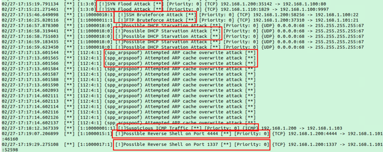
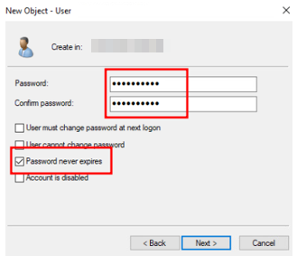

# Traffic Monitoring Final Project
## Topology, Network and Log Tables

## Splunk Server Setup on Ubuntu1
### Update Repositories and Upgrade Packages:
First, I made sure our system was up to date by running `sudo apt-get update and sudo apt-get upgrade`. This ensured that I had the latest packages and repositories ready for installation.

### Create a Splunk Account and Download and Install Splunk Enterprise:
Next, I went ahead and created an account on the Splunk website. This step was necessary to access the free trial version of Splunk Enterprise.
Once our account was set up, I downloaded the .deb package for Splunk Enterprise from the Splunk website. With the package in hand, I installed it using the command `sudo apt install ./[splunkpackage].deb`. 

### Accept the License Agreement an Start the Service:
After the installation, I navigated to the Splunk application file located in `/opt/splunk/bin`. Here, I accepted the license agreement and started the Splunk service using `sudo ./splunk start --accept-license` This command not only accepted the license agreement but also initiated the Splunk service.  I was also prompted to create an admin username and password.

### Access Splunk Web Interface: 
With the service up and running, I opened my web browser and visited http://localhost:8000. This directed us to the Splunk login page, where I logged in and proceeded with further configuration. 

### Configure Forwarding and Receiving:
Once logged into the Splunk web interface, I navigated to `Settings > Forwarding and Receiving`. Here, I configured the receiving settings by selecting a port to listen for logs on and setting up the necessary configurations for data reception.

### Installing Additional Dashboard Apps:
For better visualization and analysis, I also installed the Snort dashboard app and optionally considered installing a Windows Event Logs dashboard app. These apps provided us with specialized interfaces tailored to monitor Snort alerts and Windows event logs within Splunk.  

### Snort, Syslog Server and Splunk Forwarder on Ubuntu2
First, I updated Ubuntu2’s repositories and upgraded the packages. Next, I installed Snort on Ubuntu2 with the command `sudo apt install snort`.

### Backup and Customization of Snort Configuration:
To customize Snort for our specific needs, I backed up the original configuration file located at `/etc/snort/snort.conf` using sudo `cp /etc/snort/snort.conf /etc/snort/snort.conf.back`. Next, I cleared all preconfigured rules from the snort.conf file and verified their removal.

### Creating Custom Snort Rules:
Using this as a guideline, https://docs.snort.org/rules , I created custom rules in the snort.conf file to detect various simulated attacks, including port scanning, SYN flood attacks, SSH and FTP brute-forcing, DHCP starvation, ARP poisoning, reverse shells on specific ports, suspicious ICMP traffic, and plaintext HTTP traffic.

### Configuring ARP Poisoning Rule and Testing Alerts:
For the ARP poisoning rule, I added preprocessor variables of IP to MAC bindings in the Snort configuration file. This enabled Snort to generate an alert if any of these bindings changed. 

### Detection Testing:
After configuring the rule and adding our rule to the snort.conf file, I conducted thorough testing to ensure the effectiveness of all the custom rules I created. This involved simulating each attack scenario to verify that Snort generated alerts appropriately. I started snort using then command `snort -l /var/log/snort/ -A console -q -c /etc/snort/snort.conf -I ens160` then fired off some attacks using  `METRO`, a bash script that Anton wrote for the project (https://github.com/adot8/metro)

 

### Enabling and Configuring Rsyslog:
I enabled and started the rsyslog service using `sudo systemctl enable rsyslog`, uncommented the TCP and UDP reception lines in the configuration file located at `/etc/rsyslog.conf`, and included a line to create a folder for the syslog client based on its IP address. I also opened the ports 514 for both transport protocols on the host firewall with the command `sudo ufw allow 514/tcp` and `sudo ufw allow 514/udp`.

### Installing and Configuring Splunk Forwarder:
Like the Splunk server setup with starting the service and accepting the license, I installed the Splunk forwarder on Ubuntu2. I added the Splunk server as a forwarder using the command `./splunk add forward-server 192.168.1.100:9997`. Additionally, I configured the forwarder to monitor Apache2, Snort alerts, and syslog logs using the command `./splunk add monitor <log location>`. Source names for each log were added in the `/opt/splunkforwarder/etc/apps/search/local/inputs.conf` file.

### Creating Automation Script:
To ease the process of running Snort and Splunk, I created a simple bash script that could execute both commands with a single command. This script was then added as a cronjob to ensure it ran automatically on boot by running `crontab -e` followed by `@reboot sudo (name_of_script)`

## Setting up Active Directory and DNS services on Windows Server 2019
## Installing Active Directory and DNS:
First, My partner Swapon accessed the Server Manager from the Start menu. Navigating to `Manage`, he selected `Add Roles` and Features to get the setup process started.

He chose the default installation type being the role-based or feature-based installation and chose the server where we wanted Active Directory to be installed, being the server, we were using.

I selected the `Active Directory Domain Services` and `DNS Server` roles from the list of available roles. After being prompted to add any additional features I clicked on `Add Features` and then clicked `Next` at the AD DS page.

  

I continued with the Post-deployment configuration by clicking on `Promote this server to a domain controller`. 
Next I created a new forest and named it `SOC.local`

I then left all other options as default on the Domain Controller Options page and put in our password for the  Directory Services Restore Mode (DSRM).

Reviewing the configuration summary to verify the settings, I clicked `Install` to initiate the installation process and waited for that bad boy to finish.

### Adding Organizational Units, Groups and Users
I accessed `Active Directory Users and Computers` by navigating to `Tools` and selecting it. Then, I right clicked on our domain and chose `New`, followed by `Organizational Unit`, where I provided a name for the OU.

Next, I right-clicked on the newly created OU, selected `New`, then`Group`, and assigned a name to the group

 

I then created a new user by clicking on the OU, selecting `New`, then `User`, where I specified the user's name, username, and password, ensuring to check the `Password never expires`, option

  

To add the user to the group, I right-clicked on the user, went to `Properties`, clicked on the `Member Of`  tab, clicked Add, entered the name of our OU, clicked `Check Names`, and finally clicked `OK`

 

## Domain Joining the Ubuntu Machines
I followed this guide, https://www.server-world.info/en/note?os=Ubuntu_22.04&p=realmd, to join our Ubuntu machines to the domain. The guide provided detailed steps for the entire process. 
### Installing packages:
I ran the following command to install the packages required to join our Ubuntu machines to the domain: `apt -y install realmd sssd sssd-tools libnss-sss libpam-sss adcli samba-common-bin oddjob oddjob-mkhomedir packagekit`
### Update DNS Settings:
Configuring the Domain Controller as the machines DNS sever is needed to join the machine to the domain. I did this through the settings GUI like so.

### Discover and Join the Active Directory Domain
Using the `realm discover SOC.LOCAL` command I was able to probe the network to find the Active Directory domain configuration details, including its realm name, domain name, and server software.
To join the domain, I used the `realm join SOC.LOCAL` command. I verified the integration using the command `id Administrator@SOC.LOCAL` command.

## SplunkForwarder Setup on Windows 10
### Downloading and Installing:
I downloaded the MSI package for the Splunk Forwarder onto the Windows 10 machine.
Following the basic installation wizard, I went ahead with the installation process, providing an Admin username and password along with accepting the license.
During the configuration process, I provided the receiving indexer's IP address, which in our case was 192.168.1.100, Ubuntu1.

 

### Adding Local Windows Logs:
After the installation, I added the local Windows logs that I wanted to send to the server into the `C:\Program Files\splunkforwarder\etc\apps\search\local\inputs.conf` file of the Splunk Forwarder.
This step ensured that relevant logs were being sent to the Splunk server for analysis and monitoring

## Honeypot DHCP Server  and Syslog Configuration on vRouter
### Configuring DHCP Pool:
For testing and honeypot functionalities, I created a DHCP pool named "LOCAL" on the vRouter which is a Cisco IOS router. To keep control over network assignment and ensure specific addresses remain untouched, I excluded the following IP addresses in the screenshot. I then configured the network range of the pool as `192.168.1.0/24`. The output of the `show run | s dhcp` command is also all the commands I ran for the DHCP server setup.

### Configuring vRouter Syslog Messages Forwarding:
I configured vRouter to send its syslog messages to 192.168.1.101 (ubuntu2). Syslog messages were set to be sent up to the notifications level. This ensures that important system notifications and events are captured and sent. The output of the `show run | s logging` command is also all the commands I ran to forward the logs.

## Simulating Attacks with Kali and METRO!
### METRO!!:
I created a bash script to automate the execution of the simulated attacks, aiming to make them more beginner-friendly for others (script kiddies). The script simplifies the execution of multiple attacks, offering an approachable environment for both testing and educational purposes. 
Usage of `METRO!!` was made to be simple. Download, install and choose an attack. Simple. A short installation and usage guide has been provided in the repository. 

### Simulated Attack List:
.................

## Metro Boomin Make it Boom
Out of the 5 attacks I will show one of them in action, being attack 4 MITM Arp Poisoning via Bettercap
### Better no cap
We first start the splunkforwarder and snort on our Ubuntu2 machine using the previous bash script we wrote. We can also watch the alerts in real time with the command `tail -f /var/log/snort/alert`.

Next we run metro on the attacker machine with the command `sudo ./metro -i eth0`.  We then choose option 4 and input the target IP, in this case it will be the Windows 10 machine at 192.168.1.110

Immediately, alerts for an `Attempted Arp cache overwrite attack` fill the terminal on Ubuntu2.

Next, we visit a completely secure login page on the Windows 10 machine and put our credentials in.

We end up sniffing the POST request and successfully capturing the credentials.

We ended up being successful as the attacker, but more importantly successful at monitoring the traffic in the network and notifying about the attack taking place. However we didn’t stop it…

## Final Results
### Snort Dashboard:
The Snort dashboard provides insights into network intrusion attempts and suspicious activities. It displays the total number of events detected, their types, and the devices involved.

### Windows SOC Dashboard:
The Windows SOC dashboard offers visibility into authentication events on Windows hosts within the network. It highlights successful and unsuccessful local NTLM logins, domain account activities, and other relevant information. 

### Syslog Message Querying:
Syslog messages from Ubuntu2 and vRouter are centrally collected and can be queried on the Splunk server. By filtering with `sourcetype=cisco.ios` and `sourcetype=syslog`, administrators can easily retrieve and analyze syslog data, gaining insights into network device activities and system events.

## Resources
* https://medium.com/@dannyopara/installing-splunk-enterprise-on-ubuntu-step-by-step-guide-b545982038c3
* https://www.youtube.com/watch?v=z454piFK8W4
* https://www.linkedin.com/pulse/how-install-set-up-rsyslog-server-linux-ubuntu-20041-akshay-sharma
* https://www.server-world.info/en/note?os=Ubuntu_22.04&p=realmd
* https://github.com/adot8/metro
* https://docs.snort.org/rules/
* https://github.com/chrisjd20/Snorpy
